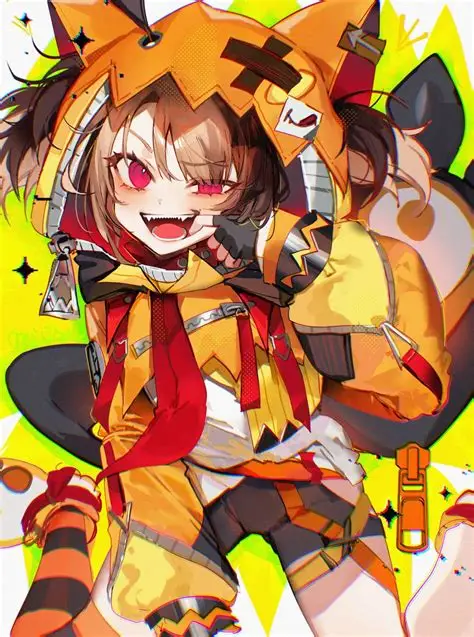

# Gigi Murin

  

> *We all have our own baggage — but still, we keep moving forward.*

A hub for everything gathered here about Gigi — an artist whose music became
a mirror. This page grows over time; each new piece gets linked below as it's added.

## Find Gigi

- **YouTube:** _(channel — to add)_
- **Socials:** _(to add)_

## Songs

| Song | Released | Page | Listen |
| --- | --- | --- | --- |
| I'll Still Be Here | October 20, 2025 | [open ›](songs/I'll%20Still%20Be%20Here.md) | [▶ YouTube](https://youtu.be/EvdDIJ2ojDM) |
| Enough | June 26, 2026 | [open ›](songs/Enough.md) | [▶ YouTube](https://youtu.be/3m15lUh0WP4) |

## Story

- [gigipapa](GigiPapa.md) — her father, and the heart behind *I'll Still Be Here*

## More to come

*Being gathered piece by piece — new songs, art, socials, and moments will be
linked here as they arrive.*

---

*A hub kept by Sora Bladeheart.*
